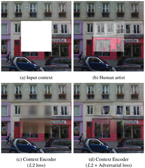
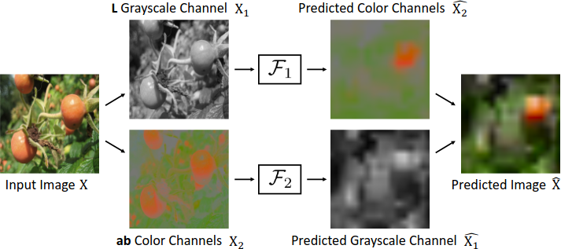
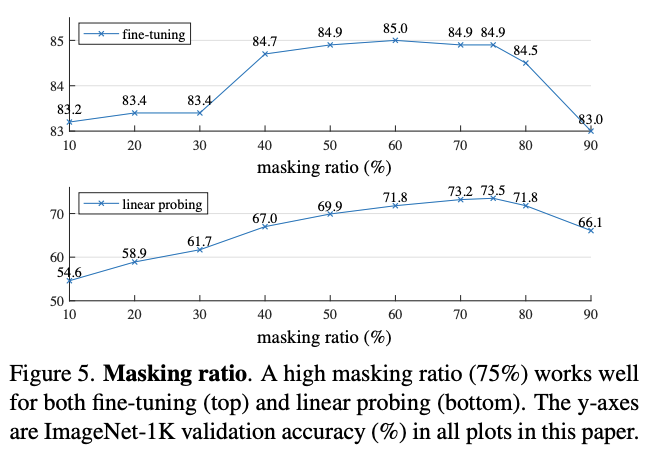
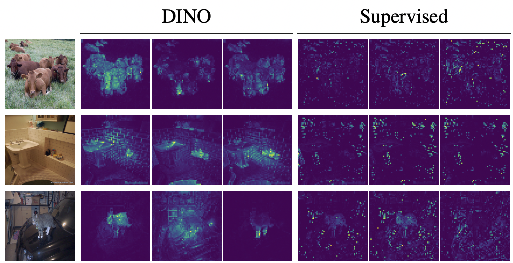
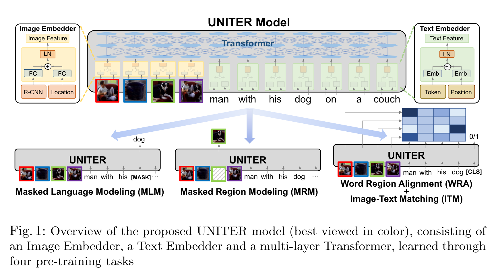
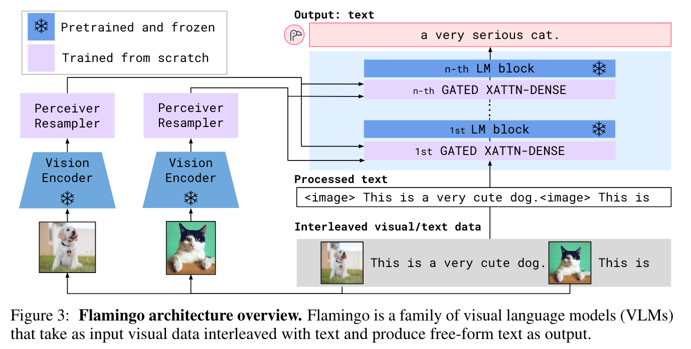
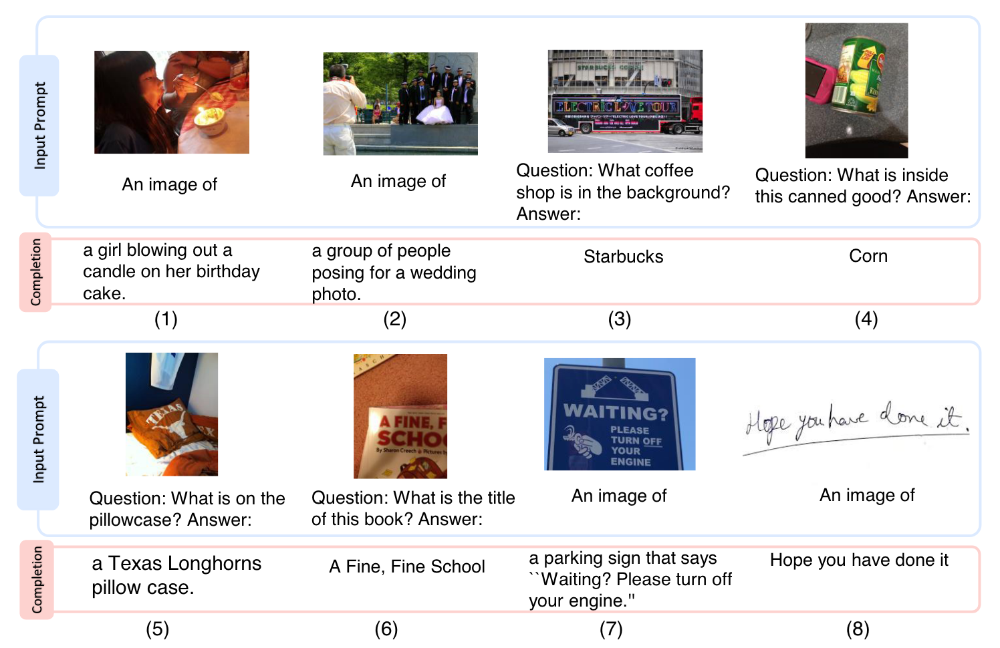

# UN/SEMI-SUPERVISED LEARNING IN VISION

# Already covered...

We have already covered (in the OCR case):

- pseudo-labels
- active learning
- data augmentation and prior knowledge of invariances
- EM algorithms

# Pre-Transformer Approaches

Prior attempts to carry over principles for language models and HMMs to the image domain:

- linearize images and apply HMM or LSTM models
- apply VQ to patches and apply syntactic models to the resulting "visual words"
- corrupt images with noise and training a network to restore them
- predict color images from grayscale
- mask parts of images and predict the masked parts (like BERT)
- determine the spatial relations between patches (like entailment)

All of these yield deep learning architectures that are potentially useful for transfer learning, but never beat supervised models.

# Masked Predictions

 

Pathak et al. 2016

# Split-Brain Autoencoder

 

Zhang et al. 2016

# Context Encoding

Doersch et al. 2016

# VISION TRANSFORMERS

# Vision Transformers

The NLP transformer architecture carries over directly to images: just change the positional embedding.  Dosovitskiy et al. 2020, arXiv:2010.11929

# BEiT - BERT Pre-Training of Image Transformers

 

BERT-like pretraining carries over directly. Bao et al., 2022

# Masked Autoencoder (MAE)

 

MAE uses a simpler architecture and no tokenization. He et al. 2021

# Masked Autoencoder - Reconstructions

 

He et al. 2021

# Masked Autoencoder - Transfer Learning

# Unsupervised Training with Transformers

Transformer architectures make BERT-like masking useful unsupervised pre-training for image-related tasks.

# OTHER APPROACHES

(Not transformer based)

- SimCLR
    - generate two differently augmented version of the same image
    - train a representation that is as similar as possible

- DINO
    - self-DIstillation with NO labels
    - discovers labels / class structure by itself

Tricky to train, highly dependent on chioce of augmentations/parameters.

<!--

# SimCLR - Contrastive Learning

Basic idea:

- generate two differently augmented versions of the same image
- train a representation that is as similar as possible for the same image, different for different images

Details:

- carefully choose augmentations, watch out for trivial solutions (e.g. color)
- separate representation from scoring
- compute "softmax over cosine similarity" over very large batches
- implemented with ResNet

# SimCLR - Contrastive Learning

Chen et al., 2020; arXiv:2002.05709

# SimCLR - Augmentations

# SimCLR - Transfer Learning Performance

# DINO

- self-DIstillation with NO labels
- discovers labels / class structure by itself
- unsupervised representation learning for images
- impressive semantic segmentation results
- attention map = segmentation map
- vision transformer or ResNet 50 based

# DINO Architecture

# DINO Results

# DINO Segmentation

- semantic segmentation by attention looks better than from supervised models

# Summary: SimCLR and DINO

High Level:

- SimCLR is a kind of _representation_ or _metric_ learning
- DINO is a kind of _clustering_
- implementations are complex and with lots of hyperparameters

Conclusions:

- tasks like these may be most useful as additional tasks combined with masking (just like BERT)

-->

# COMBINING TEXT AND IMAGE MODELS

# Combining Image and Text Models

- GPT-3, ExT5, etc. show how natural language models can be used for zero shot learning
- CLIP
    - use natural language supervision for image recognition (weak supervision)
    - vision: transformer or ResNet, language: transformer
    - permit "prompt engineering" to allow different kinds of NLP tasks
    - uses contrastive pretraining (rather than, say, captioning)

# CLIP

# CLIP Architecture

# CLIP Results

# CLIP Results

# Discussion

Current and future directions:

- combining text and image
- integrating unsupervised pretrained vision and language models
- integrating video and audio and identifying good self-supervised tasks for these (e.g., VideoMAE, Audio-MAE)
- cross-modal combinations likely also reduce the amount of training data required within each modality

# Joint Embeddings

# Joint Embeddings

- ViLBERT (Lu et al., 2019): visual question answering tasks
- LXMERT (Tan and Bansal, 2019): visual question answering, image captioning, and visual entailment.
- UNITER (Chen et al., 2020): image-text retrieval, image captioning, and visual question answering
- OSCAR (Li et al., 2020): image-text retrieval, image captioning, and visual question answering
- VILLA (Gupta et al., 2020): video; uses a hierarchical architecture to encode both frame-level features and clip-level features from videos along with textuald descriptions

# Joint Embeddings -- UNITER

- Joint image-text embedding for V+L tasks
- Large-scale pre-training over four datasets
    - COCO, Visual Genome, Conceptual Captions, SBU Captions
- Four main pre-training tasks evaluated
    - Masked Language Modeling (MLM)
    - Image-Text Matching (ITM)
    - Masked Region Modeling (MRM)
    - Masked Object Classification (MOC)

# UNITER

# Segment Anything (SAM)

# Segment Anything

- Model initialized with MAE weights
- CLIP-derived text encoding
- Promptable segmentation for weak labels using automatic prompt generation
- Self-training for pseudolabels
- Fine-tuning on labeled and pseudolabeled data

# Segment Anything

# Flamingo

# Flamingo

# Flamingo Architecture

- Flamingo is a VLM with a vision encoder and language decoder.
- Vision encoder maps input to visual embeddings.
- Language decoder generates text from visual embeddings.
- Includes architectural innovations for interleaved data.
- Trained using contrastive training.

# Flamingo - Adapters

- Flamingo is a generalization of adapter modules.
- Adapter modules are small neural networks inserted between layers of a pre-trained model.
- GATED XATTN-DENSE is initialized using an atanh-gating mechanism.
- Unlike adapter modules, Flamingo is designed to add completely new functionality to an existing model.

# MetaLM / KOSMOS-1

# MetaLM

# MetaLM

# MetaLM

# MetaLM Performance

- VQA -- Visual question answering
  - Size: 250k images, 1.2M questions
  - Previous best: 66.7% accuracy
  - New result: 68.4% accuracy

- COCO -- Image captioning
  - Size: 123k images
  - Previous best: 36.2 CIDEr score
  - New result: 40.4 CIDEr score

- StoryCloze -- Given a four-sentence story and two possible endings, choose the correct ending.
   - New result: State-of-the-art performance

# KOSMOS-1

# KOSMOS-1

# SUMMARY

# SUMMARY

- joint image and text models look very promising
    - text provides zero-shot learning capability to imges
    - images provide additional grounding/semantics to text
- performance is mixed
    - slow inference
    - pure vision models may still be better on specific tasks
